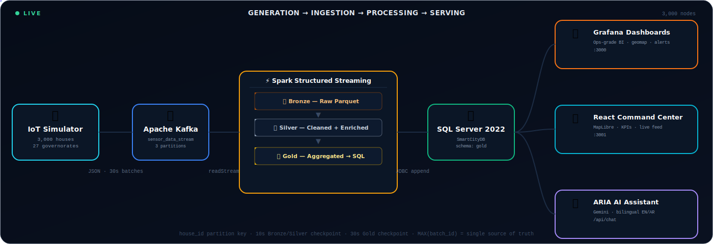
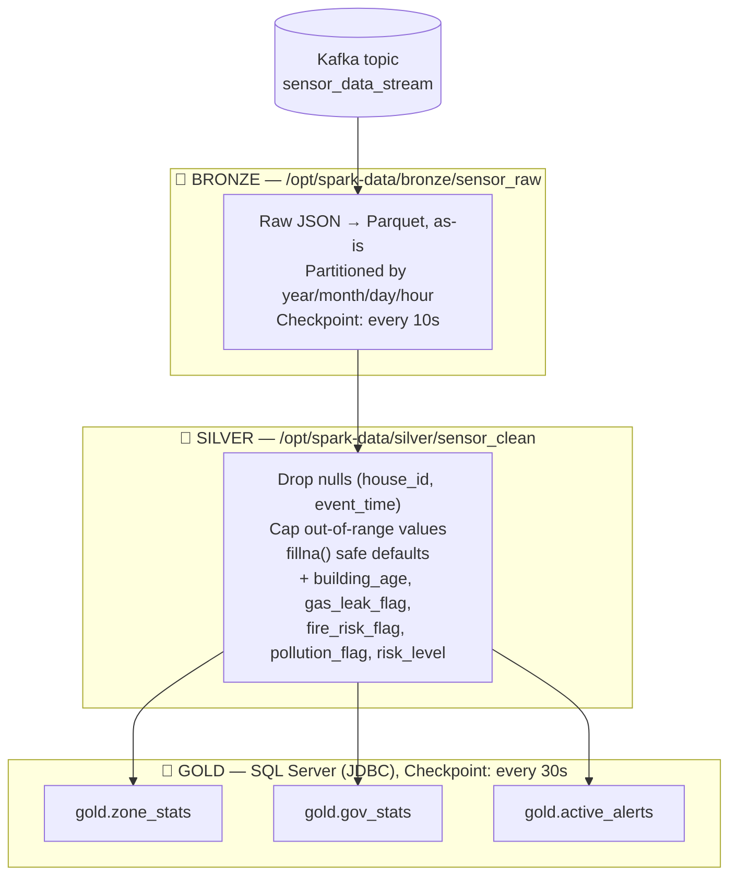
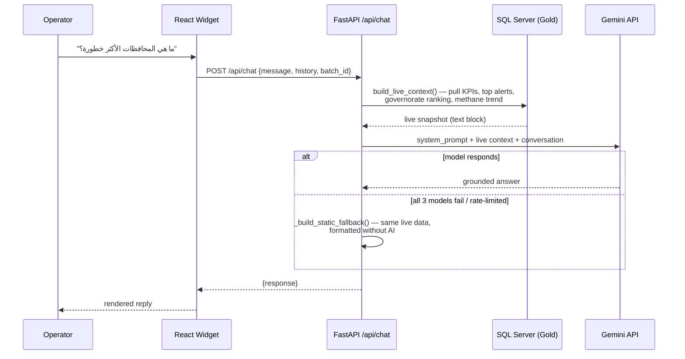

<div align="center">

# 🏙️ Smart City Gas & Air Safety Monitoring Platform

### Real-time IoT data engineering pipeline protecting 3,000 buildings across all 27 governorates of Egypt

*Graduation Project — Digital Egypt Pioneers Initiative (DEPI) 2026*

<p>
  
  
  
  
  
  
  
  
</p>

<p>
  
  
  
  
  
</p>

[Overview](#-overview) •
[Architecture](#-system-architecture) •
[Data Flow](#-the-data-journey) •
[Components](#-component-breakdown) •
[Getting Started](#-getting-started) •
[API](#-api-reference) 

</div>

<br/>

## 📖 Overview

### The Problem

Gas leaks, LPG explosions, and unmonitored air quality are a silent, everyday risk in dense residential and industrial areas. In a city the scale of a nation like Egypt — millions of homes, mixed building ages, aging gas infrastructure, and industrial zones sitting next to housing — three failure modes repeat constantly:

- **Gas & LPG leaks** go undetected until concentration is already inside the flammability range.
- **Fire precursors** (rising heat + smoke) are noticed by people, not systems, which means minutes are lost.
- **Air quality degradation** (CO, CO₂, PM2.5/PM10, AQI) is chronic and invisible — there is no live, governorate-level visibility for operators or citizens.

Civil protection and utility operators today mostly react *after* an incident is reported by a person. There is no unified, real-time, city-scale telemetry layer that watches every building continuously and tells operators **where**, **why**, and **how urgently** to respond.

### The Solution

This project is an **end-to-end real-time data engineering platform** that simulates a nationwide IoT sensor deployment — **3,000 sensor nodes across Egypt's 27 governorates** — streaming methane, LPG, smoke, CO, AQI, CO₂, PM2.5/PM10 and temperature readings every 30 seconds, running them through a proper **Bronze → Silver → Gold (Medallion) pipeline**, and serving the results through two live dashboards and a bilingual AI safety assistant.

It is built to demonstrate a production-shaped data engineering pattern, not a toy demo:

| Capability | How it's delivered |
|---|---|
| Ingest at scale, in order | Kafka topic partitioned by `house_id` |
| Process continuously, not in batch jobs | Spark **Structured Streaming**, not a cron job |
| Never trust "average of everything" | **`MAX(batch_id)`** is enforced as the single source of truth everywhere |
| Explain *why* an alert fired | Rule-based root-cause engine (`detect_root_cause`) |
| Stay useful when a dependency is down | Multi-model AI fallback chain + static DB-backed fallback |
| Be operable by a human at 3 AM | Grafana + a purpose-built React command center, both reading identical data |

---

## ✨ Key Features

- 🛰️ **3,000 simulated sensor nodes** across 27 governorates with realistic random-walk physics + injected anomalies (gas leak / fire / pollution)
- 📨 **Kafka streaming backbone** — a 3-partition topic keyed by house, decoupling generation from processing
- ⚡ **Spark Structured Streaming** Medallion pipeline: raw Bronze Parquet → validated/enriched Silver Parquet → aggregated Gold tables in SQL Server
- 🗄️ **SQL Server 2022 Gold layer** purpose-built for BI: `gold.zone_stats`, `gold.gov_stats`, `gold.active_alerts`
- 📊 **Dual live dashboards** — an ops-grade Grafana board and a custom React/FastAPI "Command Center" — both reading the *exact same* batch snapshot
- 🤖 **ARIA** — a bilingual (Arabic/English) AI operations assistant grounded in the live database, with a 3-model fallback chain and a DB-backed static fallback so it never goes silent
- 🧭 **Root-cause detection** — every alert is tagged `GAS_LEAK`, `HIGH_TEMP`, `SMOKE_SPIKE`, or `ELEVATED_RISK`, not just a raw score
- 🐳 **Fully containerized** — 9 Docker Compose services, one command to boot the entire platform

---

## 🏗️ System Architecture

```mermaid
flowchart LR
    subgraph GEN["📡 GENERATION"]
        SIM["Python IoT Simulator<br/>3,000 houses · random walk + anomalies"]
    end

    subgraph STREAM["📨 STREAMING"]
        KAFKA[("Apache Kafka<br/>sensor_data_stream<br/>3 partitions, keyed by house_id")]
    end

    subgraph PROC["⚡ PROCESSING — Spark Structured Streaming"]
        direction TB
        BRONZE["🥉 Bronze<br/>raw Parquet, append-only"]
        SILVER["🥈 Silver<br/>cleaned, validated, feature-enriched"]
        GOLD["🥇 Gold<br/>windowed aggregations"]
        BRONZE --> SILVER --> GOLD
    end

    subgraph STORE["🗄️ STORAGE"]
        SQL[("SQL Server 2022<br/>SmartCityDB.gold")]
    end

    subgraph SERVE["📊 SERVING"]
        GRAFANA["Grafana<br/>ops dashboards"]
        REACT["React Command Center<br/>FastAPI-backed"]
        ARIA["🤖 ARIA<br/>Gemini-powered chatbot"]
    end

    SIM -- "JSON, every 30s" --> KAFKA
    KAFKA -- readStream --> BRONZE
    GOLD -- "JDBC append" --> SQL
    SQL --> GRAFANA
    SQL --> REACT
    SQL -. "live context injection" .-> ARIA
    REACT -.->|chat requests| ARIA

    style SIM fill:#0b1626,stroke:#22d3ee,color:#fff
    style KAFKA fill:#0b1626,stroke:#3b82f6,color:#fff
    style BRONZE fill:#0b1626,stroke:#b45309,color:#fff
    style SILVER fill:#0b1626,stroke:#94a3b8,color:#fff
    style GOLD fill:#0b1626,stroke:#eab308,color:#fff
    style SQL fill:#0b1626,stroke:#10b981,color:#fff
    style GRAFANA fill:#0b1626,stroke:#f97316,color:#fff
    style REACT fill:#0b1626,stroke:#06b6d4,color:#fff
    style ARIA fill:#0b1626,stroke:#a78bfa,color:#fff
```



All nine containers are orchestrated by a single `docker-compose.yml`:

| # | Service | Image / Base | Role |
|---|---|---|---|
| 1 | `zookeeper` | `confluentinc/cp-zookeeper:7.5.0` | Kafka cluster coordination |
| 2 | `kafka` | `confluentinc/cp-kafka:7.5.0` | Message broker (`sensor_data_stream`, 3 partitions) |
| 3 | `kafka-ui` | `provectuslabs/kafka-ui` | Visual topic/partition inspector |
| 4 | `iot-producer` | custom (Python 3.11-slim) | The 3,000-house simulator + Kafka producer |
| 5 | `sqlserver` | `mcr.microsoft.com/mssql/server:2022-latest` | Gold-layer data warehouse |
| 6 | `spark-consumer` | custom (`apache/spark:3.5.0`) | Structured Streaming Bronze→Silver→Gold job |
| 7 | `grafana` | `grafana/grafana:latest` | Provisioned ops dashboard |
| 8 | `fastapi-backend` | custom (Python 3.11-slim-bookworm + MS ODBC 18) | REST API + ARIA chat endpoint |
| 9 | `react-frontend` | custom (Node 18 → served build) | Command Center SPA |

---

## 🌊 The Data Journey

*From a single sensor reading in a simulated house in Aswan, to a colored dot on a map in Cairo — animated end to end.*

<p align="center">
  
</p>

<details>
<summary><b>▶ Step-by-step walkthrough (click to expand)</b></summary>
<br/>

1. **Generation (`simulation/`)** — Every **30 seconds**, `kafka_producer.py` iterates all 3,000 `HouseState` objects. Each house evolves its own sensors via a bounded random walk (`house_state.py`) pulled toward realistic hourly/monthly baselines (cooking hours, traffic hours, seasonal temperature). With a base probability of **0.4%** per house per batch (scaled up to ×2.5 for high-risk buildings, down to ×0.4 for low-risk ones), a house instead enters an **anomaly**: `gas_leak`, `fire`, or `pollution`, escalating its relevant sensors for 4–10 consecutive batches before resolving. `utils.py` then computes an `alert_status` (`NORMAL`/`WARNING`/`CRITICAL`) and a weighted `risk_score` (0–100) for every reading.
2. **Ingestion (`Kafka`)** — Each of the 3,000 readings is serialized to JSON and published to the `sensor_data_stream` topic (3 partitions, gzip-compressed, `acks=all`), **keyed by `house_id`** — this guarantees every event for a given house lands in the same partition and is processed in order.
3. **Bronze (`spark_streaming.py`)** — Spark Structured Streaming reads the topic continuously (`readStream`), parses the 26-field JSON schema, and appends the **untouched raw data** to Parquet, partitioned by `year/month/day/hour`. Checkpointed every **10 seconds**. This is the immutable "what actually happened" record.
4. **Silver** — The same micro-batch is cleaned (null-dropping, range-capping, safe defaults), then enriched with derived features: `building_age`, `gas_leak_flag`, `fire_risk_flag`, `pollution_flag`, and a categorical `risk_level`. Written to Parquet on the same 10-second cadence.
5. **Gold** — Every **30 seconds**, three aggregations are computed from the batch and written to SQL Server over JDBC: `zone_stats` (per governorate+zone), `gov_stats` (per governorate), and `active_alerts` (every WARNING/CRITICAL row, individually). Each write is tagged with an incrementing `batch_id` — **the single source of truth** every downstream consumer must filter on.
6. **Serving** — Grafana, the FastAPI backend, and ARIA all run the exact same pattern: `WHERE batch_id = (SELECT MAX(batch_id) FROM gold.<table>)`. This is what guarantees the map, the KPI cards, the chatbot's answer, and the Grafana panel never disagree with each other.
7. **Consumption** — The React Command Center polls the FastAPI backend every 30 seconds and renders the live map, KPI deltas, methane trend, and governorate risk ranking. An operator (or ARIA, on their behalf) can drill into any alert to see its root cause.

</details>

---

## 🥉🥈🥇 Medallion Architecture — Deep Dive



<table>
<tr><th>Layer</th><th>Format</th><th>Purpose</th><th>Retention behavior</th></tr>
<tr>
<td><b>🥉 Bronze</b></td>
<td>Parquet (append-only)</td>
<td>Exact, immutable copy of every event ever ingested — the audit trail and replay source</td>
<td>Grows unbounded; intended to be pruned/archived periodically in a real deployment</td>
</tr>
<tr>
<td><b>🥈 Silver</b></td>
<td>Parquet (append-only)</td>
<td>Validated + feature-enriched data, safe to run analytics or ML against</td>
<td>Same as Bronze — this is the reusable "clean" dataset</td>
</tr>
<tr>
<td><b>🥇 Gold</b></td>
<td>SQL Server tables</td>
<td>Pre-aggregated, query-optimized, BI/serving-ready — this is the only layer dashboards and ARIA ever touch</td>
<td>Every consumer filters to the latest `batch_id` only — historical batches remain queryable for trend charts (e.g. the 5-minute methane trend) but are never blindly averaged</td>
</tr>
</table>

**Gold schema** (see [`database/init.sql`](database/init.sql)):

<table>
<tr><td valign="top">

**`gold.zone_stats`**
```
governorate, zone
avg/max_methane_ppm
avg_temperature_c
avg_smoke_level, avg_co_ppm
avg/max_aqi
avg/max_risk_score
total_readings
critical_count, warning_count
anomaly_count
zone_risk_level
batch_id, snapshot_time
```

</td><td valign="top">

**`gold.gov_stats`**
```
governorate
avg/max_risk_score
avg_methane_ppm, avg_aqi
avg_temperature_c
total_houses
critical_count, warning_count
total_anomalies
gov_risk_level
batch_id, snapshot_time
```

</td><td valign="top">

**`gold.active_alerts`**
```
event_id, house_id
governorate, zone
latitude, longitude
building_type, alert_status
risk_score
methane_ppm, smoke_level
co_ppm, temperature_c, aqi
is_anomaly, alert_time
batch_id
```

</td></tr>
</table>

---

## 🧩 Component Breakdown

### 1 · IoT Simulator — `simulation/`

| File | Responsibility |
|---|---|
| `metadata_config.py` | Ground truth for all 27 governorates + their real zones/coordinates, building type weights, sensor thresholds, normal ranges, anomaly escalation curves |
| `house_state.py` | `HouseState` dataclass — one instance per house; `build_houses()` procedurally places 3,000 houses with geography-aware coordinates and risk-weighted attributes; `.update()` advances physics one batch at a time |
| `kafka_producer.py` | The production loop — builds the fleet once, then every 30s updates all houses, computes alert status + risk score, and publishes to Kafka |
| `utils.py` | `calculate_alert_status()` and `calculate_risk_score()` — the two functions that turn raw sensor floats into an operational verdict |

### 2 · Apache Kafka — `docker-compose.yml` (`zookeeper`, `kafka`, `kafka-ui`)

Topic `sensor_data_stream`, **3 partitions**, 168h retention, keyed by `house_id` so per-house ordering is guaranteed. Kafka UI at `:8080` lets you watch messages land in real time.

### 3 · Apache Spark Structured Streaming — `spark/`

`spark_streaming.py` runs three independent `writeStream` queries against the same parsed source DataFrame — Bronze (10s trigger), Silver (10s trigger), Gold (30s trigger) — each with its own checkpoint directory so failures in one layer never corrupt another.

### 4 · SQL Server 2022 — `database/init.sql`

Hosts only the **Gold** layer (`SmartCityDB.gold` schema). Bronze/Silver stay as Parquet on a Docker volume — SQL Server is reserved for what BI tools are good at: fast, indexed, aggregated queries.

### 5 · Grafana — `docker/grafana/`

A fully provisioned dashboard (`smartcity.json`, auto-reloaded every 10s) with:
- 🗺️ Egypt-wide **Geomap** of every active alert
- 🚨 Critical / ⚠️ Warning stat panels
- 📈 Live methane trend (last 5 minutes)
- 🏆 "Risk by Governorate" bar chart (green `<8`, orange `8–12`, red `≥12`)
- 📋 Deduplicated active alerts table

### 6 · FastAPI Backend — `docker/custom-dashboard/backend/main.py`

The single REST surface for both the frontend and the AI assistant — see the [API Reference](#-api-reference) below. Every query enforces `MAX(batch_id)` and uses `ROW_NUMBER()` de-duplication (CRITICAL always wins over WARNING for the same `house_id`).

### 7 · React Command Center — `docker/custom-dashboard/frontend/`

A dark, glassmorphism-styled ops console (`App.jsx`) built with MapLibre GL, Recharts, and Tailwind:
- Live topology map with pulsing severity markers
- KPI cards with batch-over-batch deltas
- Methane trajectory chart with warning/critical reference lines
- Governorate risk bar chart and threat-distribution donut
- Embedded **ARIA** chat widget

### 8 · ARIA — the AI Operations Assistant

"**A**utomated **R**isk **I**ntelligence **A**ssistant" — a bilingual (Arabic/English) chatbot that is *grounded*, not generic:



Resilience is the design point here: three Gemini models are tried in order, and if every single one fails, ARIA still answers using the *same* live database snapshot — formatted deterministically instead of by AI. The user never sees a bare error.

---

## 📊 Risk Scoring & Alerting Logic

**Alert status** (`utils.calculate_alert_status`) — the *first* sensor to cross a line decides the verdict:

| Sensor | Normal | ⚠️ Warning | 🔴 Critical |
|---|---|---|---|
| Methane (CH₄) | 1.0 – 6.0 ppm | ≥ 50 ppm | ≥ 150 ppm |
| LPG | 1.0 – 12.0 ppm | ≥ 80 ppm | ≥ 200 ppm |
| CO | 0.1 – 2.5 ppm | ≥ 9 ppm | ≥ 35 ppm |
| CO₂ | 400 – 620 ppm | ≥ 1000 ppm | ≥ 2000 ppm |
| Smoke level | 0 – 6 | ≥ 20 | ≥ 45 |
| AQI | 40 – 90 | ≥ 100 | ≥ 150 |
| Temperature | 18 – 35 °C | ≥ 42 °C | ≥ 55 °C |

**Risk score** (`utils.calculate_risk_score`) — a weighted 0–100 composite, then scaled by the house's risk profile:

```
risk_score =  min(CH4 / 150, 1) × 35   +   min(LPG / 200, 1) × 20
            + min(smoke / 45, 1) × 20  +   min(CO / 35, 1)   × 10
            + min(AQI / 150, 1) × 10   +   min(CO2 / 2000,1) × 3
            + min(temp / 55, 1) × 2

final_score = risk_score × { low: 0.85, medium: 1.0, high: 1.15 }
```

**Root cause** (`main.py: detect_root_cause`) — every alert is explained, not just scored:

```
methane ≥ 50        →  GAS_LEAK
temperature ≥ 42     →  HIGH_TEMP
smoke ≥ 20           →  SMOKE_SPIKE
none of the above    →  ELEVATED_RISK   (combined CO · AQI · LPG pressure)
```

**Anomaly injection** — base rate **0.4%** per house per batch, multiplied ×2.5 (high-risk), ×1.3 (medium-risk) or ×0.4 (low-risk) buildings. At steady state this converges to the expected operating mix of roughly **91% Normal / 8% Warning / 1% Critical** across the fleet.

---

## 🛠️ Tech Stack

<table>
<tr><th>Layer</th><th>Technology</th></tr>
<tr><td><b>Simulation</b></td><td>Python 3.11, NumPy, <code>kafka-python</code></td></tr>
<tr><td><b>Streaming</b></td><td>Apache Kafka 7.5.0 (Confluent), Zookeeper</td></tr>
<tr><td><b>Processing</b></td><td>Apache Spark 3.5.0 — Structured Streaming, PySpark</td></tr>
<tr><td><b>Storage</b></td><td>Parquet (Bronze/Silver) · SQL Server 2022 (Gold)</td></tr>
<tr><td><b>Backend API</b></td><td>FastAPI, SQLAlchemy, pyodbc, httpx</td></tr>
<tr><td><b>AI</b></td><td>Google Gemini API (<code>gemini-2.5-flash-lite</code> → <code>gemini-flash-latest</code> → <code>gemini-2.5-flash</code> fallback chain)</td></tr>
<tr><td><b>Frontend</b></td><td>React 18, Vite, Tailwind CSS, MapLibre GL, Recharts, Axios, lucide-react</td></tr>
<tr><td><b>BI</b></td><td>Grafana (provisioned dashboards + datasources)</td></tr>
<tr><td><b>Infrastructure</b></td><td>Docker & Docker Compose (9 orchestrated services)</td></tr>
</table>

---

## 📁 Project Structure

```
Smart-City-Gas-Air-Safety-Monitoring/
├── database/
│   └── init.sql                     # Gold-layer DDL: zone_stats, gov_stats, active_alerts
├── docker/
│   ├── docker-compose.yml           # All 9 services, networks, volumes
│   ├── requirements.txt             # Optional local (host) Python env for start.bat
│   ├── start.bat                    # Full guided bring-up (Windows)
│   ├── custom-dashboard/
│   │   ├── backend/                 # FastAPI service
│   │   │   ├── Dockerfile
│   │   │   ├── main.py              # REST API + /api/chat (ARIA)
│   │   │   └── requirements.txt
│   │   └── frontend/                # React service
│   │       ├── Dockerfile           # Multi-stage: Vite build → serve
│   │       ├── package.json
│   │       ├── vite.config.js
│   │       ├── tailwind.config.js
│   │       └── src/
│   │           ├── App.jsx          # Command Center + ARIA widget
│   │           ├── main.jsx
│   │           └── index.css
│   └── grafana/
│       ├── dashboards/smartcity.json
│       └── provisioning/{datasources,dashboards}/*.yaml
├── simulation/                      # IoT producer service
│   ├── Dockerfile
│   ├── entrypoint.sh
│   ├── kafka_producer.py
│   ├── house_state.py
│   ├── metadata_config.py
│   ├── utils.py
│   └── requirements.txt
├── spark/                           # Structured Streaming service
│   ├── Dockerfile
│   ├── entrypoint.sh
│   └── spark_streaming.py
├── assets/
│   └── pipeline-flow.svg            # The animated diagram above
└── README.md
```

---

## 🚀 Getting Started

### Prerequisites

- [Docker](https://www.docker.com/) & Docker Compose v2
- ~6 GB free RAM for the full stack (SQL Server + Spark are the heaviest)
- A free [Google Gemini API key](https://aistudio.google.com/app/apikey) (optional — the platform runs fine without it, ARIA simply serves the static, DB-backed fallback instead of AI-generated answers)

### 1 — Clone the repository

```bash
git clone https://github.com/som3a0/Smart-City-Gas-Air-Safety-Monitoring.git
cd Smart-City-Gas-Air-Safety-Monitoring/docker
```

### 2 — Configure environment variables

Create a `.env` file **next to `docker-compose.yml`** (this file is git-ignored and must never be committed):

```env
GEMINI_API_KEY=your_gemini_api_key_here
```

### 3 — Build & start every service

```bash
docker compose build --no-cache
docker compose up -d
```

### 4 — Initialize the Gold-layer schema

Wait ~30–40 seconds for SQL Server to finish starting, then:

```bash
docker cp ../database/init.sql sqlserver:/tmp/init.sql
docker exec sqlserver /opt/mssql-tools18/bin/sqlcmd -S localhost -U sa -P "SmartCity@2026" -No -i /tmp/init.sql
```

> 💡 Windows users can run `start.bat` from the `docker/` folder to do steps 3–4 automatically, with a follow-up menu for tailing logs.

### 5 — Verify it's alive

```bash
docker compose ps           # all 9 services should be "running (healthy)"
docker compose logs -f iot-producer     # you should see batches printing every ~30s
```

Then open **http://localhost:3001** — the map should start populating within one or two batches.

---

## 🌐 Service URLs & Access

| Service | URL | Credentials |
|---|---|---|
| **React Command Center** | http://localhost:3001 | — |
| **FastAPI Swagger docs** | http://localhost:8000/docs | — |
| **Grafana** | http://localhost:3000 | `admin` / `SmartCity@2026` |
| **Kafka UI** | http://localhost:8080 | — |
| **Spark UI** | http://localhost:4040 | — |
| **SQL Server** (SSMS: SQL Server Authentication) | `localhost,1433` | `sa` / `SmartCity@2026` |

<sub>Credentials above are local-development defaults defined in `docker-compose.yml` for this project only — rotate them before ever exposing any of these ports outside your machine.</sub>

---

## 🔌 API Reference

Base URL: `http://localhost:8000`

| Method | Endpoint | Description |
|---|---|---|
| `GET` | `/api/kpis` | Current critical/warning counts + average risk score, latest `batch_id` |
| `GET` | `/api/active-alerts` | All active (non-`NORMAL`) alerts, de-duplicated per house, with root cause |
| `GET` | `/api/map-data` | Same as above, shaped for map markers |
| `GET` | `/api/risk-by-gov` | All 27 governorates ranked by average risk score |
| `GET` | `/api/methane-trend` | Last 5 minutes of city-wide average methane readings |
| `POST` | `/api/chat` | ARIA — body: `{ "message": str, "history": [...], "batch_id": int? }` |
| `GET` | `/health` | Service + AI configuration status |

Full interactive schema: **http://localhost:8000/docs**

---

## 💡 Key Engineering Decisions

- **`MAX(batch_id)` as the only valid filter.** Every Gold-layer query — Grafana, React, and ARIA alike — reads exactly one batch snapshot. Averaging across historical batches was an early failure mode (numbers that never matched between dashboards) and is now treated as a bug class, not a style choice.
- **The frontend derives the map *and* the governorate breakdown from `/api/active-alerts` alone**, rather than from separate endpoints, specifically to make count mismatches between the map, the KPI cards, and the incident feed structurally impossible.
- **`alert_status` is trusted, never recomputed client-side.** Spark is the single place risk classification happens; the frontend and ARIA only display it.
- **`VITE_API_URL` is a Docker build ARG, not a runtime ENV.** Vite inlines `import.meta.env.VITE_*` at *build* time — passing it as a runtime environment variable is a classic trap that silently ships `undefined` to the browser.
- **AI resilience over AI cleverness.** ARIA's 3-model fallback chain plus a fully deterministic, DB-grounded static fallback means a Gemini outage degrades the assistant's *personality*, never its *usefulness*.

---

## 📸 Screenshots

<div align="center">
  
</div>

---

---

## 🗺️ Roadmap

- [ ] Automated Parquet retention/compaction job for the Bronze layer
- [ ] Alerting integration (email/SMS/webhook) on new CRITICAL events
- [ ] Historical trend analytics beyond the current 5-minute window
- [ ] Kubernetes manifests as an alternative to Docker Compose for scale-out
- [ ] Unit + integration test suite for the risk-scoring and root-cause logic

---

## 🤝 Contributing

Issues and pull requests are welcome. Please open an issue first to discuss significant changes.

## 📄 License

This project is licensed under the **MIT License** — see [`LICENSE`](LICENSE) for details.

## 🙏 Acknowledgments

- **[Digital Egypt Pioneers Initiative (DEPI)](https://depi.gov.eg/)** — for the program this graduation project was built under
- Apache Kafka, Apache Spark, and the Grafana community for the open-source foundations this platform is built on

<div align="center">
<sub>Made with 🇪🇬 for the Digital Egypt Pioneers Initiative — 2026</sub>
</div>
